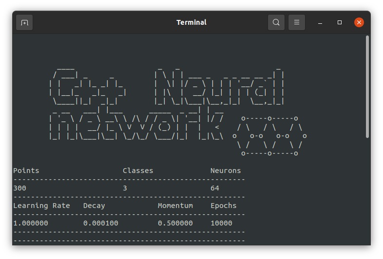

# Neural Networks in C++ for Classification


## Description
This project implements a basic neural network using C++ for classification tasks. The network is designed to handle a spiral dataset and includes components for forward and backward propagation, as well as optimization.

## Data Preparation

- **`NN_Input`**: Used to generate the spiral dataset.
- **`spiralInput`**: Holds the features of the data.
- **`groundTruthInput`**: Holds the corresponding labels.

## Neural Network Structure

The network consists of the following components:

- **Layers**:
```cpp
  NN_Layer_Dense layer1(2, 64);                                <-- First dense layer with 2 inputs and 64 neurons.
  NN_Layer_Dense layer2(64, 3);                                <-- Second dense layer with 64 inputs and 3 outputs.
```
- **Activations**:
```cpp
  NN_ActivationReLU activationReLu;                            <-- ReLU activation function for the hidden layer.
  NN_ActivationSoftMax activationSoftMax;                      <-- SoftMax activation function for the output layer.
```
- **Loss Functions**:
```cpp
  NN_ActivationSMaxCategoricalCrossEntropyLoss activationLoss; <-- Combined SoftMax activation and categorical cross-entropy loss.
  NN_CategoricalCrossEntropyLoss categCrossEntropyloss;        <-- Categorical cross-entropy loss.
```
- **Optimizer**:
```cpp
  SGD sgdOptimizer(LEARNING_MOMENTUM, initialLearningRate);    <-- Stochastic Gradient Descent optimizer with momentum.
```
## Training

- **Forward Propagation**: Computes outputs for each layer and calculates loss and accuracy.
- **Backward Propagation**: Updates gradients for each layer and applies the optimizer.
- **Epoch Logging**: Periodically prints the current training metrics.

## Neural Network Architecture

Here is a basic visual representation of the neural network architecture used:
```cpp
     +---------+        +---------+        +---------+
     | Input   |        | Hidden  |        | Output  |
     | Layer   |        | Layer   |        | Layer   |
     +---------+        +---------+        +---------+
        |                    |                  |
        V                    V                  V
     [ x1 ]               [ h1 ]              [ o1 ]
     [ x2 ]  --->         [ h2 ]   --->        [ o2 ]
     [ ... ]              [ ... ]             [ o3 ]
     [ xn ]              [ h64 ]            (3 outputs)
        |                    |                  |
        V                    V                  V
     +---------+        +---------+        +---------+
     | ReLU    |        | SoftMax |        | Categorical |
     | Activation|      | Activation|       | Cross-Entropy|
     +---------+        +---------+        +---------+

```